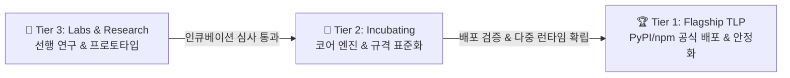

  

  <b>AMEVA Open-Source Foundation (AOSF / AMEVA 오픈소스 재단)</b> 
  <i>"Democratizing On-Device AI & Autonomous Systems Without Cloud Tax"</i> 
  클라우드 종속과 서버 비용 없는 순수 클라이언트 엣지 AI & 자율 시스템의 민주화

  <a href="docs/foundation/CHARTER.md"><b>📜 Foundation Charter</b></a> |
  <a href="docs/foundation/GOVERNANCE.md"><b>⚖️ Governance & Meritocracy</b></a> |
  <a href="docs/foundation/INCUBATION_POLICY.md"><b>🌱 Incubation Policy</b></a> |
  <a href="docs/foundation/SPONSORSHIP.md"><b>💖 Sponsorship</b></a> |
  <a href="https://uno-km.github.io/uno-km/docs/foundation/"><b>🌐 Foundation Portal</b></a>

  
  
  
  

---

# 🏛️ About AMEVA Open-Source Foundation (AOSF)

**AMEVA Open-Source Foundation (AOSF / AMEVA 오픈소스 재단)**은 아파치 소프트웨어 재단(ASF)과 리눅스 재단(Linux Foundation)의 개방형 거버넌스 및 메리토크라시(Meritocracy) 모델을 기반으로 설립된 비영리 독립 오픈소스 기술 협의체입니다.

우리는 거대 클라우드 벤더의 인프라 과금(Cloud Tax)과 프라이버시 침해 없이, 개인의 스마트폰(Android Termux), 브라우저(WebGPU/WASM), 엣지 임베디드 기기에서 **100% 데이터 주권을 보장하는 자율 AI 및 오토메이션 생태계**를 연구·개발·보급합니다.

> [!NOTE]
> **2원화 분리 원칙 (Separation of Concerns)**:
> AOSF 재단 기관과 설립자 개인([김은호 / Eunho Kim, `@uno-km`](README.md))의 엔지니어링 프로필은 공과 사를 명확히 분리하여 운영됩니다. 재단 산하의 모든 프로젝트는 특정 개인이나 기업에 종속되지 않고 영구적인 공공재(Public Good)로 관리됩니다.

---

# 📊 3-Tier Project Portfolio Status (재단 산하 3단계 프로젝트 현황)

AOSF는 프로젝트의 성숙도, 안정성 및 커뮤니티 배포 상태에 따라 3단계 라이프사이클(3-Tier Lifecycle)로 엄격히 분류하여 육성합니다.

### 🏆 Tier 1: Flagship Top-Level Projects (TLP / 공식 대표 오픈소스)
*엄격한 릴리즈 게이트를 통과하여 PyPI 및 npm에 공식 배포되고, 크로스 플랫폼 프로덕션 레벨의 안정성을 입증한 프로젝트입니다.*

| 프로젝트 (Project) | 런타임 & 기술 스택 | 핵심 혁신 및 역할 | 공식 문서 & 패키지 |
|:---|:---:|:---|:---:|
| **📱 [Termux-Playwright](https://github.com/uno-km/termux-playwright-demo)** `termux-playwright` | **Android Bionic** Python · Node.js | **안드로이드 Termux 비루트(Non-root) 브라우저 자동화** ARM64 Chromium CDP 직접 제어, 헤드리스 스크래핑 & 테스팅 파이프라인 | [📖 공식 문서](https://uno-km.github.io/termux-playwright-demo/)   |
| **🎨 [Termux-Diffusion](https://github.com/uno-km/termux-diffusion)** `termux-diffusion` | **On-Device AI** Python · Node.js | **안드로이드 ARM64 네이티브 온디바이스 Stable Diffusion** 모바일 엣지 기기에서 클라우드 연결 없이 로컬 이미지 생성 및 가속 | [📖 공식 문서](https://uno-km.github.io/termux-diffusion/)   |

---

### 🧪 Tier 2: Incubating Projects (인큐베이팅 프로젝트)
*활발히 개발 및 표준화가 진행 중이며, 플래그십 TLP 승격을 위해 테스트 커버리지 및 런타임 확장을 거치고 있는 프로젝트입니다.*

| 프로젝트 (Project) | 분류 | 핵심 목표 및 현황 | 바로가기 |
|:---|:---:|:---|:---:|
| **⚡ [AMEVA-Forge](https://github.com/uno-km/ameva-forge)** | WebGPU DL | 서버 비용 제로의 Browser-Native WebGPU Autograd Engine (PyTorch 호환 & WGSL 셰이더) | [📖 문서](https://uno-km.github.io/ameva-forge/) \| [⚡ 데모](https://uno-km.github.io/ameva-forge/demo.html) |
| **🔥 [Termux-Torch](https://github.com/uno-km/termux-torch)** | Tensor Engine | 안드로이드 Bionic 네이티브 경량 텐서 & 엄격한 Autograd backward 정책 엔진 | [🐙 GitHub](https://github.com/uno-km/termux-torch) |
| **🎙️ [Termux-Whisper](https://github.com/uno-km/AMEVA-STT-Trainer)** | On-Device STT | 엣지 디바이스 전용 Whisper 한국어 음성인식 & LoRA 파인튜닝 파이프라인 | [🐙 GitHub](https://github.com/uno-km/AMEVA-STT-Trainer) |

---

### 🔬 Tier 3: Labs & Research (연구소 및 선행 프로토타입)
*새로운 패러다임, 실험적 아키텍처, 커뮤니티 협업 및 미래 비전을 탐색하는 선행 연구 프로젝트입니다.*

| 프로젝트 (Project) | 연구 영역 | 연구 목표 및 내용 |
|:---|:---:|:---|
| **🎭 [Dead Internet Theatre](https://github.com/uno-km/AMEVA-Dead-Internet-Threatre)** | Simulation | Docker 기반 100% 자율 멀티에이전트 가상 사회 시뮬레이터 (자율적 담론 형성) |
| **🎼 [AMEVA Agent Orchestra](https://github.com/uno-km/AMEVA-Agent-Orchestra)** | Multi-Agent | Nobles(전략 의사결정)와 Workers(실행) 계층 분해 기반 다중 에이전트 오케스트레이션 |
| **💻 [AMEVA-Multi-CLI](https://github.com/uno-km/AMEVA-Multi-CLI)** | Terminal UI | 트리 기반 무한 분할 레이아웃, 80 FPS 저지연 스마트 PTY & DevSecOps 가드레일 |
| **🪟 [AMEVA Window Assistant](https://github.com/uno-km/AMEVA-Window-Assistant)** | Desktop AI | OCR-First 화면 인식 & 로컬 llama.cpp 추론 기반의 프라이버시 보호형 Windows AI |
| **⚙️ [MCP-Wasm-Toolkit](https://github.com/uno-km/MCP-Wasm-Toolkit)** | WASM Sandbox | 위험 연산을 100% 브라우저 Pyodide WASM 샌드박스로 격리 실행하는 MCP 툴킷 |
| **🧠 [BitNet](https://github.com/uno-km/BitNet)** | 1-bit LLM | 1-bit 양자화(1.58-bit) LLM ARM NEON 커널 및 빌드 최적화 오픈소스 PR 참여 |

---

# 📜 Foundation Governance & Operational Guidelines

재단의 모든 규정과 운영 방침은 다음 공식 문서에 명시되어 있습니다:

- [📜 **Foundation Charter (재단 헌장)**](docs/foundation/CHARTER.md) — 설립 사명, 엣지 퍼스트 기술 범위, 지적재산권 및 라이선스 정책
- [⚖️ **Governance & Meritocracy (운영 규정)**](docs/foundation/GOVERNANCE.md) — 아파치식 메리토크라시, PMC 및 커미터 권한, +1/0/-1 의사결정 투표제
- [🌱 **Incubation Policy (인큐베이션 정책)**](docs/foundation/INCUBATION_POLICY.md) — 신규 프로젝트 제안부터 TLP 플래그십 승격까지의 3단계 가이드라인
- [💖 **Sponsorship & Support (후원 및 스폰서십)**](docs/foundation/SPONSORSHIP.md) — 오픈소스 공공재 유지를 위한 재정 투명성 및 스폰서십 안내

---

# 🌐 Join the Movement

AMEVA 재단은 전 세계 모든 엣지 컴퓨팅 개발자, 온디바이스 AI 연구자, 오픈소스 기여자의 참여를 환영합니다.

- **공식 웹 포털**: [https://uno-km.github.io/uno-km/docs/foundation/](https://uno-km.github.io/uno-km/docs/foundation/)
- **중앙 리포지토리**: [https://github.com/uno-km/uno-km](https://github.com/uno-km/uno-km)
- **설립자 & 이사회 의장 (Founder & Chair)**: [김은호 (Eunho Kim / `@uno-km`)](README.md)

---

  &copy; 2026 <b>AMEVA Open-Source Foundation (AOSF)</b>. All Rights Reserved. 
  Licensed under the <a href="http://www.apache.org/licenses/LICENSE-2.0">Apache License, Version 2.0</a>.

