# AMEVA Open-Source Foundation (AOSF)

  <svg xmlns="http://www.w3.org/2000/svg" viewBox="0 0 512 512" width="160" height="160">
    <defs>
      <radialGradient id="space-fill" cx="50%" cy="50%" r="50%">
        <stop offset="0%" stop-color="#162244" />
        <stop offset="70%" stop-color="#0B132B" />
        <stop offset="100%" stop-color="#060A17" />
      </radialGradient>
      <linearGradient id="aqua-sky-grad" x1="0%" y1="0%" x2="100%" y2="100%">
        <stop offset="0%" stop-color="#00F5D4" />
        <stop offset="40%" stop-color="#00E5FF" />
        <stop offset="70%" stop-color="#38BDF8" />
        <stop offset="100%" stop-color="#3A86FF" />
      </linearGradient>
      <radialGradient id="cyan-glow" cx="50%" cy="50%" r="50%">
        <stop offset="0%" stop-color="#FFFFFF" stop-opacity="1" />
        <stop offset="40%" stop-color="#00F5D4" stop-opacity="0.9" />
        <stop offset="100%" stop-color="#3A86FF" stop-opacity="0" />
      </radialGradient>
      <filter id="emblem-shadow" x="-10%" y="-10%" width="120%" height="120%">
        <feDropShadow dx="0" dy="8" stdDeviation="10" flood-color="#000000" flood-opacity="0.8" />
      </filter>
    </defs>
    <g filter="url(#emblem-shadow)">
      <path d="M 256 36 C 390 36, 465 112, 460 240 C 455 368, 380 445, 256 440 C 132 435, 48 355, 52 235 C 57 115, 122 36, 256 36 Z" fill="url(#space-fill)" />
      <path d="M 256 36 C 395 36, 470 112, 465 240 C 460 368, 385 448, 256 442 C 175 436, 105 395, 72 335" fill="none" stroke="url(#aqua-sky-grad)" stroke-width="40" stroke-linecap="round" />
      <line x1="256" y1="95" x2="162" y2="335" stroke="url(#aqua-sky-grad)" stroke-width="36" stroke-linecap="round" />
      <line x1="256" y1="95" x2="350" y2="335" stroke="url(#aqua-sky-grad)" stroke-width="36" stroke-linecap="round" />
      <line x1="195" y1="240" x2="317" y2="240" stroke="url(#aqua-sky-grad)" stroke-width="30" stroke-linecap="round" />
      <line x1="195" y1="240" x2="260" y2="325" stroke="#00F5D4" stroke-width="24" stroke-linecap="round" stroke-dasharray="10 5" />
      <circle cx="256" cy="95" r="40" fill="url(#cyan-glow)" />
      <circle cx="256" cy="95" r="22" fill="#FFFFFF" stroke="#00F5D4" stroke-width="6" />
      <circle cx="195" cy="240" r="26" fill="#00E5FF" stroke="#FFFFFF" stroke-width="5" />
      <circle cx="162" cy="335" r="32" fill="#00F5D4" stroke="#FFFFFF" stroke-width="4" />
      <circle cx="260" cy="325" r="26" fill="#00F5D4" stroke="#FFFFFF" stroke-width="5" />
      <circle cx="317" cy="240" r="24" fill="#38BDF8" />
      <circle cx="350" cy="335" r="32" fill="#3A86FF" stroke="#FFFFFF" stroke-width="4" />
    </g>
  </svg>

  <strong>Democratizing On-Device AI &amp; Autonomous Systems Without Cloud Egress Dependency</strong> 
  <em>클라우드 종속과 서버 비용 없는 100% 순수 클라이언트 엣지 AI &amp; 분산 자율 소프트웨어 생태계</em>

  
  
  
  
  

  <a href="https://uno-km.vercel.app/foundation/charter.html">재단 헌장 (Charter)</a> •
  <a href="https://uno-km.vercel.app/foundation/governance.html">거버넌스 (Governance)</a> •
  <a href="https://uno-km.vercel.app/foundation/incubation.html">인큐베이션 정책</a> •
  <a href="https://uno-km.vercel.app/foundation/sponsorship.html">스폰서십 안내</a> •
  <a href="https://uno-km.vercel.app/llms.txt">AI 피드 (llms.txt)</a>

---

## 1. About AMEVA Open-Source Foundation (AOSF)

**AMEVA Open-Source Foundation (AOSF / AMEVA 오픈소스 재단)**은 거대 빅테크의 비싼 클라우드 API 과금과 서버 종속을 거부하고, 전 세계 모든 인디 개발자, 학생, 엔지니어들을 위해 주머니 속 기기에서 100% 자립 구동하는 AI를 만드는 **'거지스트림(The Grassroots Edge Hacker Stream)' 온디바이스 오픈소스 연대**입니다.

수천만 원짜리 고가 클라우드 GPU 클러스터가 없어도, 내 주머니 속 스마트폰(갤럭시 A35, S21, S25), 친구의 깨진 폰(S20), 어머니 서랍 속 구식 기기(S7)로도 최신 LLM, 음성인식, 컴퓨터 비전, 이미지 생성이 돌아갈 수 있도록 14개 라이브러리를 안드로이드 Bionic과 Vulkan SPIR-V로 바닥부터 뜯어고쳤습니다.

우리는 스스로 모래주머니를 차거나 지키지도 못할 관료주의적 허세에 목을 매지 않습니다. 오직 실전 동작하는 코드와 성능 지표로 증명하며, 깃허브에서 전 세계 개발자들의 솔직한 피드백과 쓴소리를 달게 받습니다.

---

## 2. AOSF 전체 생태계 아키텍처 (Ecosystem Map)

```mermaid
flowchart TD
    subgraph AppLayer ["1. 사용자 애플리케이션 계층 (End-User Applications)"]
        Workstation["AMEVA Workstation (Web/Desktop)<br/>- 100% 로컬 WebGPU LLM (Qwen2.5)<br/>- 대용량 PDF/DOCX 3초 맵리듀스 편집<br/>- 인앱 비디오 컷팅 & 1초 AI 배경제거"]
        InfraIndex["Infra-Index Platform<br/>- 69개 클라우드 GPU/CPU 실시간 시세 집계<br/>- AI 반도체 시황 & 논문 인텔리전스"]
    end

    subgraph CoreLibs ["2. Tier 1 플래그십 라이브러리 & SDK (Core Ecosystem)"]
        Playwright["termux-playwright<br/>(ARM64 비루팅 모바일 브라우저 자동화)"]
        Diffusion["termux-diffusion<br/>(ARM64 네이티브 온디바이스 Stable Diffusion)"]
        STT["termux-stt<br/>(통합 온디바이스 음성인식 & 128d 화자분리)"]
        Train["termux-train<br/>(초경량 온디바이스 텐서 & DAG 자동미분)"]
        BitNet["termux-bitnet<br/>(ARM64 NEON 1.58비트 온디바이스 LLM 추론)"]
        AIChain["Termux-AIChain<br/>(Zero-Dependency Edge Agent & LLM Chaining Framework)"]
        MCPHub["ameva-mcp-hub<br/>(유니버설 다국어 WASM & AI 벡터 MCP 허브)"]
        Forge["AMEVA-Forge<br/>(브라우저 네이티브 WebGPU 텐서 가속 엔진)"]
        Sentinel["AMEVA-Sentinel<br/>(0-Data 프라이버시 봇 탐지 & 트래픽 거버넌스)"]
        LlamaCpp["termux-llamacpp<br/>(사전 빌드 GGUF 런타임 & OpenAI 호환 서버)"]
        Vision["termux-vision<br/>(Zero-Dep 온디바이스 컴퓨터 비전 & VLM 추론)"]
        TTS["termux-tts<br/>(경량 온디바이스 음성합성 & C++/Python/Node 런타임)"]
        VulkanRuntime["AMEVA-Runtime<br/>(SoC 감지 및 디바이스 리소스 적응형 런타임 & HAL)"]
    end

    subgraph RuntimeLayer ["3. 기저 런타임 및 디바이스 리소스 계층 (System Runtimes)"]
        AndroidBionic["Android Bionic libc (ARM64 NEON SIMD & Device Runtimes)"]
        WebGPU_WASM["Browser WebGPU / WASI WASM Runtime"]
        NodeLinux["Node.js / Express / Linux User-Space Engine"]
    end

    AppLayer --> CoreLibs
    CoreLibs --> RuntimeLayer
```

---

## 3. Tier 1: 플래그십 탑레벨 프로젝트 명세 (TLP Catalog)

엄격한 자동화 검증과 릴리즈 게이트를 통과하여 프로덕션 환경에서 즉시 사용 가능한 공식 배포 패키지 목록입니다.

| 프로젝트 명 | 기술 스택 & 런타임 | 핵심 기능 및 공학적 해결 과제 | 패키지 설치 및 레퍼런스 |
| :--- | :--- | :--- | :--- |
| **`AMEVA Workstation`** | WebGPU, WASM, React | 클라이언트 중심 100% 클라이언트 온디바이스 WebGPU 로컬 AI 워크스테이션. 대용량 문서 3초 맵리듀스 요약, 인앱 비디오 컷편집, 1초 AI 누끼 및 무음 자동 컷팅 제공. | [Web App 실행](https://ameva-workstation-web-core.vercel.app/) [GitHub 저장소](https://github.com/uno-km/AMEVA-Workstation-Web) |
| **`Infra-Index Platform`** | Next.js, Python, FastAPI | 글로벌 69개 클라우드 GPU/CPU/스토리지 실시간 시세 집계 및 AI 반도체 시황 인텔리전스 모니터링 플랫폼. | [Web App 실행](https://infraindex-platform-front.vercel.app/) [공식 문서](https://uno-km.vercel.app/lib/infra-index/) |
| **`AMEVA-Sentinel`** | TypeScript, WebCrypto, Node | 마우스 좌표 수집 0%, 키로깅 0%의 0-Data 프라이버시 봇 탐지 및 6대 결정론적 스코어카드 기반 다계층 트래픽 거버넌스 보안 SDK. | `npm install ameva-sentinel` [공식 문서](https://uno-km.vercel.app/lib/sentinel/) |
| **`AMEVA-MCP-Hub`** | WASI WebAssembly, Node.js | 호스트 컴파일러 없이 C++, Rust, Java, Python, Go 도구를 인메모리 실행하고 깃허브 다중 리포지토리를 실시간 구독하는 유니버설 AI 벡터 MCP 허브. | `npx ameva-mcp-hub` `npm install ameva-mcp-hub` [공식 문서](https://uno-km.vercel.app/lib/mcp/) |
| **`AMEVA-Forge`** | WebGPU, Pyodide, WASM | 서버 비용이 전혀 들지 않는 브라우저 네이티브 WebGPU 딥러닝 텐서 엔진. PyTorch 호환 텐서 API 및 WGSL 셰이더 메모리 바인딩 지원. | `pip install ameva` [공식 문서](https://uno-km.vercel.app/lib/forge/) |
| **`AMEVA-Runtime`** | C++20, SoC Auto-Detection, Python, Node | 안드로이드 Termux 환경에서 시스템 SoC를 자동 감지하여 STT/Vision/LLM/Diffusion에 필요한 디바이스 리소스를 적응형으로 최적화하는 추상화 계층(HAL) 및 런타임. | `pip install ameva-runtime` `npm install @ameva/runtime` [공식 문서](https://uno-km.vercel.app/lib/vulkan/) |
| **`termux-aichain`** | Python 3, TypeScript, DAG | 외부 의존성 0개(Zero-Dependency)로 LLM 체이닝과 자율 에이전트 워크플로우를 실행하는 50KB 초경량 모바일 에이전트 프레임워크. | `pip install termux-aichain` `npm install termux-aichain` [공식 문서](https://uno-km.vercel.app/lib/aichain/) |
| **`termux-bitnet`** | C++17 NEON, Python, Node | ARM64 NEON DotProd 가속 기반 C++ 코어와 Python/Node.js 듀얼 게이트웨이를 통한 1.58비트(i2_s) 온디바이스 LLM 추론 프레임워크. | `npm install termux-bitnet` `pip install termux-bitnet` [공식 문서](https://uno-km.vercel.app/lib/bitnet/) |
| **`termux-playwright`** | Android Bionic, Node, Python | 안드로이드 스마트폰(ARM64 Termux) 유저스페이스에서 비루팅 환경으로 Chromium CDP를 직접 제어하는 초저전력(5W) 분산 자동화 라이브러리. | `npm install termux-playwright` `pip install termux-playwright` [공식 문서](https://uno-km.vercel.app/lib/playwright/) |
| **`termux-diffusion`** | C++ NEON, ARM64 SIMD, Python | 디바이스 리소스를 활용한 Multi-SoC 연산 및 VAE Tiling을 통해 클라우드 없이 모바일 단말기에서 직접 구동되는 온디바이스 Stable Diffusion 이미지 생성 런타임. | `npm install termux-diffusion` `pip install termux-diffusion` [공식 문서](https://uno-km.vercel.app/lib/diffusion/) |
| **`termux-stt`** | Whisper.cpp, Vosk, Python | Whisper.cpp, Vosk, Sherpa-ONNX를 결합하고 순수 파이썬 기반 128차원 화자 분리(Diarization)를 수행하는 온디바이스 음성인식 통합 엔진. | `npm install termux-stt` `pip install termux-stt` [공식 문서](https://uno-km.vercel.app/lib/stt/) |
| **`termux-tts`** | C++17, Piper, ARM64 NEON | 안드로이드 단말기에서 클라우드 없이 초저지연 고품질 한국어/영어 음성을 합성하는 경량 온디바이스 TTS 런타임. | `npm install termux-tts` `pip install termux-tts` [공식 문서](https://uno-km.vercel.app/lib/tts/) |
| **`termux-train`** | C, SafeTensors, Python | SafeTensors 직렬화 및 LoRA 파인튜닝을 지원하는 Bionic C 기반 초경량 온디바이스 텐서 연산 & DAG 자동미분(Autograd) 딥러닝 프레임워크. | `pip install termux-train` [공식 문서](https://uno-km.vercel.app/lib/train/) |
| **`termux-llamacpp`** | C++17, GGUF, POSIX | 안드로이드 Termux ARM64 전용 제로 컴파일 사전 빌드 GGUF LLM 런타임 및 OpenAI 호환 REST/SSE 수퍼바이저 서버. | `pip install termux-llamacpp` `npm install termux-llamacpp` [공식 문서](https://uno-km.vercel.app/lib/llamacpp/) |
| **`termux-vision`** | Python, JS, NEON, VLM | 순수 ARM64 NEON 비전 커널과 디바이스 리소스 최적화를 결합한 제로 디펜던시 모바일 컴퓨터 비전 & 온디바이스 VLM 멀티모달 추론 엔진. | `pip install termux-vision` `npm install termux-vision` [공식 문서](https://uno-km.vercel.app/lib/vision/) |

---

## 4. Tier 2 & Tier 3: 인큐베이팅 및 선행 연구 프로젝트

- **`AMEVA-Doc-AI`**: 온디바이스 대용량 문서 파싱 및 로컬 벡터 검색 엔진 ([GitHub](https://github.com/uno-km/AMEVA-Doc-AI))
- **`AMEVA-Sandbox-Runtime`**: WebAssembly 기반 격리형 마이크로 샌드박스 런타임 ([npm](https://www.npmjs.com/package/ameva-sandbox-runtime))
- **`Dead Internet Theatre`**: Docker 기반 자율 멀티에이전트 사회 시뮬레이터 ([GitHub](https://github.com/uno-km/AMEVA-Dead-Internet-Threatre))
- **`AMEVA Agent Orchestra`**: Nobles(전략 의사결정)와 Workers(실행) 계층 분해 기반 다중 에이전트 오케스트레이션 ([GitHub](https://github.com/uno-km/AMEVA-Agent-Orchestra))
- **`BitNet Kernel Contributions`**: 1-bit(1.58-bit) LLM을 위한 ARM NEON 커널 및 빌드 최적화 오픈소스 기여 ([GitHub](https://github.com/uno-km/BitNet))

---

## 5. 스폰서십 및 솔직한 개발 이야기 (Sponsorship & Grassroots Story)

AOSF의 모든 연구와 오픈소스 소프트웨어는 상업적 벤더의 독점 투자나 영리 목적의 유료화 없이, **순수한 오픈 커뮤니티의 자발적 후원과 1인 인디 개발자의 생존 지원**으로 운영됩니다.

> **"빅테크의 수억 원짜리 H100 클러스터가 없어도, 내 주머니 속 폰과 서랍 속 굴러다니는 구형 기기로 온디바이스 AI를 해낼 수 있다는 것을 증명하고 싶었습니다."**

### 😭 솔직하게 고백하는 개발 환경의 현실 (웃픈 이야기)
- **주머니와 서랍 속 기기 총출동**: 내 폰 갤 A35, S21, 24개월 할부 대출로 산 S25... 친구가 버리려던 깨진 갤20은 바짓가랑이 붙잡고 뺏어와 손가락 찔려가며 터치 테스트하고, 어머니 서랍 속 구식 갤7까지 24시간 풀가동으로 혹사시키고 있습니다.
- **라면과 공항 와이파이로 버티는 생존 코딩**: 하루 한 끼 라면으로 때우고, 편의점 1,500원 커피값도 아껴가며 터미널 창과 싸우고 있습니다. 작업실 와이파이가 10분마다 끊겨서 노트북과 깨진 폰들을 챙겨 들고 인천공항이나 24시간 카페 구석에서 벌벌 떨며 공용 와이파이로 `git push origin main` 때려 넣는 짠내 나는 현실입니다.

### 🔥 우리가 뜯어고친 14대 온디바이스 플래그십 무기고
빅테크가 폰에서는 불가능하다고 했던 것들을, 우리는 안드로이드 Bionic libc와 ARM64 NEON 어셈블리, 그리고 Vulkan 컴퓨트 셰이더를 밑바닥부터 다 뜯어고쳐 완성했습니다:
- **`Termux-BitNet`**: 1.58비트 LLM 3진 양자화 커널 Bionic 이식! NEON DotProd + Vulkan GPU 1줄 패키징.
- **`Termux-TTS`**: 가벼운 DSP부터 22.05kHz Vulkan GPU 스튜디오 신경망까지 4-Tier 복원형 음성 합성.
- **`Termux-Vision`**: 150MB OpenCV 전면 배제! 순수 Canny/Sobel 알고리즘 + SmolVLM Vulkan GPU 제로카피 시각 지능.
- **`Termux-AIChain`**: LangChain 배제! 외부 의존성 제로 순수 위상 정렬 DAG 기반 50KB 초경량 모바일 오케스트레이터.
- **`Termux-LlamaCpp`**: 20분 컴파일 고통 끝! Bionic 최적화 사전 빌드로 10초 만에 대형 모델 추론.
- **`STT` · `Diffusion` · `Train` · `Playwright` · `Forge` · `Sentinel` · `Infra-Index` · `MCP-Hub` · `Runtime`** 완전 가동.

### 💰 모래주머니 벗고 솔직하게 말씀드리는 후원금 집행
지키지도 못할 거창한 재정 독립성 선언이나 기기 명판 각인 같은 허세는 부리지 않습니다:
1. **당근마켓/이베이 중고 테스트 폰 구출**: 스냅드래곤, 엑시노스, 디멘시티, 텐서 등 다양한 칩셋 공기계를 구해와 모든 폰에서 크래시 없이 돌아가도록 검증합니다.
2. **개발자의 생명수 (커피값, 식비, 인터넷 요금)**: 끼니 거르지 않고, 맑은 정신으로 밤샘 버그를 잡고 패키지를 배포할 수 있는 최소한의 생존 비용입니다.
3. **24시간 실기기 테스트 환경 유지**: 방 한구석 멀티탭에 매달린 테스트 폰들이 타버리지 않고 24시간 연속 추론 테스트를 견딜 수 있도록 쿨러와 충전 허브를 유지합니다.

### 공식 후원 채널
- **🐙 GitHub Sponsors (개발자 직접 후원)**:  
  👉 [https://github.com/sponsors/uno-km](https://github.com/sponsors/uno-km) *(국내외 카드, 페이팔 원클릭 정기/일시 후원)*
- **💖 Open Collective (재단 연구 기금)**:  
  👉 [https://opencollective.com/ameva-fund](https://opencollective.com/ameva-fund) *(100% 실시간 영수증 투명 공개)*
- **🏛️ 공식 웹 포털**:  
  👉 [https://uno-km.vercel.app/foundation/sponsorship.html](https://uno-km.vercel.app/foundation/sponsorship.html)

---

## 6. 오픈소스 커뮤니티 참여 및 깃허브 방문 안내

AOSF는 전 세계 모든 소프트웨어 엔지니어, 학생, 연구원의 코드 기여와 거침없는 피드백을 진심으로 환영합니다!

- **공식 깃허브 조직**: [https://github.com/uno-km](https://github.com/uno-km)
- **공식 기술 포털**: [https://uno-km.vercel.app/foundation/index.html](https://uno-km.vercel.app/foundation/index.html)
- **개발자 기술 블로그**: [https://uno-kim.tistory.com/](https://uno-kim.tistory.com/) (쌩초보코딩단, 천천히 앞으로)
- **AI 에이전트 전용 명세서**: [https://uno-km.vercel.app/llms.txt](https://uno-km.vercel.app/llms.txt)

> *"우리는 완벽하다고 허세 부리지 않습니다. 맨땅에서 스마트폰의 성능을 쥐어짜내는 야생의 엔지니어들이며, 메인스트림의 값비싼 클라우드에 대항하는 '거지스트림'의 연대입니다. 코드에 부족한 점이 있다면 깃허브 이슈와 PR로 회초리를 들어주십시오. 달게 받고 더 가볍고 빠른 코드로 증명하겠습니다."*
