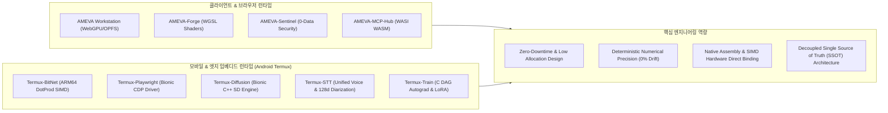

# 엔지니어링 포트폴리오 (Engineering Portfolio)
## 소버린 온디바이스 AI & 분산 시스템 소프트웨어 엔지니어링

- **작성자**: 김은호 (Eunho Kim)
- **직무 분야**: Systems Architect / Senior Full-Stack Engineer
- **공식 포트폴리오 웹사이트**: [https://uno-km.vercel.app/](https://uno-km.vercel.app/)
- **재단 기술 포털 (AOSF)**: [https://uno-km.vercel.app/foundation/](https://uno-km.vercel.app/foundation/)
- **GitHub 저장소**: [https://github.com/uno-km](https://github.com/uno-km)
- **최종 갱신일**: 2026년 8월

---

## 1. 개요 및 기술 철학 (Executive Summary)

본 문서는 클라우드 서버 의존성 및 API 비용을 배제하고, 클라이언트 하드웨어(PC 브라우저 WebGPU/WASM, Android Termux ARM64)의 물리적 컴퓨팅 자원을 직접 제어하여 구동하는 **소버린 온디바이스(Sovereign On-Device) AI 런타임 및 시스템 소프트웨어 제품군**에 대한 공식 기술 명세서입니다.

- **핵심 목표**: 서버 비용 0원(Zero Cloud Egress), 데이터 프라이버시 무결성(Zero-Data Leakage), 저전력 엣지 네이티브 런타임 구현
- **기술 스택 범주**: WebGPU Compute Shaders (WGSL), WebAssembly (WASI / Pyodide), C++17 ARM64 NEON SIMD, Android Bionic User-space Runtime, TypeScript/Node.js, Python C-Extension
- **배포 및 검증 표준**: PyPI 및 npm 정식 패키지 배포, 자동화 테스트 파이프라인(CI/CD) 통과, 실기기(Galaxy S20/S24 등) 실시간 원격 검증 완료

---

## 2. 주력 플래그십 시스템 (Tier 1 Flagship Systems)

### 2.1 AMEVA Workstation (Web / Desktop)

클라이언트 브라우저 환경에서 서버와의 데이터 송수신 없이 로컬 WebGPU 자원만으로 거대 언어 모델(LLM) 추론 및 대용량 멀티미디어 처리를 수행하는 100% 온디바이스 워크스테이션 웹 애플리케이션입니다.

```
[클라이언트 브라우저]
  ├── WebGPU Device Context (Qwen2.5 0.5B / 1.5B / 7B 로컬 추론)
  ├── 3초 MapReduce 대용량 PDF / DOCX 계층적 텍스트 청킹 파서
  ├── HTML5 Canvas Spatial Map (문서 속 문서 계층 노드 에디터)
  └── Web Audio / WebCodecs (인앱 비디오 컷팅 & 1초 AI 배경제거 & 무음 자동 분할)
```

- **주요 기능 및 기술 사양**:
  - **로컬 LLM 엔진**: WebGPU 기반 Qwen2.5(0.5B/1.5B/7B) 인메모리 가중치 바인딩 및 토큰 스트리밍
  - **대용량 문서 맵리듀스**: 수백 페이지의 PDF/DOCX 문서를 브라우저 웹 워커에서 병렬 분할 파싱하여 3초 이내에 계층 요약 수행
  - **무손실 미디어 처리**: WebCodecs API 기반 인앱 비디오 무인코딩 컷편집, Web Audio 기반 음성 무음 구간 자동 검출, 1초 AI 배경 분리
  - **프라이버시 무결성**: 서버 API 전송 없이 브라우저 로컬 스토리지/OPFS(Origin Private File System) 내에서만 데이터 처리
- **적용 시스템**: 사내 기밀 문서 로컬 분석 시스템, 오프라인 엔터프라이즈 워크벤치
- **실행 및 레퍼런스 링크**:
  - [라이브 웹 애플리케이션 실행](https://ameva-workstation-web-core.vercel.app/)
  - [GitHub 저장소](https://github.com/uno-km/AMEVA-Workstation-Web)

---

### 2.2 AMEVA-MCP-Hub (Universal Polyglot WASM & AI Vector Hub)

단일 Node.js 프로세스 내부에서 WASI WebAssembly 바이트코드를 인메모리로 격리 실행하여, 호스트 환경에 기가바이트 단위의 컴파일러 설치 없이 C++, Rust, Java, Python, Go 도구를 <1ms 속도로 구동하고 다중 깃허브 리포지토리를 실시간 동기화하는 모델 컨텍스트 프로토콜(MCP) 허브 & SDK입니다.

- **버전 및 배포 상태**: `v3.0.0 (Universal Polyglot & AI Vector MCP Hub)` / npm 공식 배포 완료
- **해결한 공학적 문제**:
  - 기존 MCP 구성 시 리포지토리마다 호스트 PC에 언어별 빌드 체인(JDK, Clang, Rustc, Python venv)을 개별 설치해야 하는 환경 오염 및 메모리 낭비 제거
  - 인메모리 WASI 샌드박스를 통해 콜드 스타트 지연을 1ms 미만으로 단축하고, 다중 도구의 격리성 보장
- **핵심 아키텍처**:
  - **다국어 WASM 실행기**: 호스트 의존성 없는 단일 런타임 바이트코드 인터프리터
  - **AI 벡터 시맨틱 라우터**: 고차원 임베딩 코사인 유사도 기반으로 AI 에이전트 질문에 부합하는 도구를 실시간 검색·호출 (Top-K 매칭)
  - **동적 리포지토리 구독**: GitHub 저장소 매니페스트를 실시간 폴링/구독하여 프로세스 재시작 없이 신규 도구 즉시 핫리로드
- **패키지 설치 및 실행**:
  ```bash
  # 1회성 즉시 허브 실행
  npx ameva-mcp-hub

  # 라이브러리/SDK 의존성 설치
  npm install ameva-mcp-hub
  ```
- **레퍼런스 링크**:
  - [npm 패키지 페이지](https://www.npmjs.com/package/ameva-mcp-hub)
  - [공식 기술 문서](https://uno-km.vercel.app/lib/mcp/)
  - [GitHub 저장소](https://github.com/uno-km/ameva-mcp-hub)

---

### 2.3 AMEVA-Sentinel (Privacy-First Observability & Threat Scoring SDK)

사용자 키 입력 및 마우스 좌표를 서버로 전송하지 않는 0-Data 정책 기반으로, 브라우저 구조 신호(DOM 변조, CDP 신호, 확장 프로그램 주입)만을 수집하여 클라이언트 내부에서 확정적 0~100점 위험도를 연산하고 HMAC-SHA256으로 무결성을 검증하는 웹 보안 관측 계층 SDK입니다.

- **버전 및 배포 상태**: `v1.0.0 (Target Discrimination Standard)` / npm 공식 배포 완료
- **해결한 공학적 문제**:
  - 기존 봇 탐지 솔루션의 무분별한 키로깅 및 마우스 트래킹으로 인한 GDPR/개인정보보호법 위반 리스크 원천 차단
  - 블랙박스 AI 모델 대신 검증 가능한 6대 가중치 규칙 엔진을 통해 오탐(False Positive) 방지 및 설명 가능한 점수 산출
- **핵심 아키텍처**:
  - **0-Data 신호 수집**: 키 스트로크/개인 식별 정보(PII) 수집 0%, 브라우저 객체 구조적 이상치(Automation Flags, Webdriver, DevTools)만 평가
  - **결정론적 0~100 스코어링**: 7대 봇 분류기(검색엔진, AI 에이전트, 소셜 미디어 크롤러, 스크래퍼 등) 선형 정규화
  - **sv1 암호화 토큰 발급**: WebCrypto API 기반 HMAC-SHA256 서명 클라이언트 토큰을 백엔드에서 0.1ms 이내에 검증
- **패키지 설치 및 실행**:
  ```bash
  # npm 설치
  npm install ameva-sentinel

  # 또는 브라우저 CDN 주입
  <script src="https://cdn.jsdelivr.net/npm/ameva-sentinel/dist/sentinel.min.js"></script>
  ```
- **레퍼런스 링크**:
  - [npm 패키지 페이지](https://www.npmjs.com/package/ameva-sentinel)
  - [공식 기술 문서](https://uno-km.vercel.app/lib/sentinel/)
  - [GitHub 저장소](https://github.com/uno-km/ameva-sentinel)

---

## 3. Termux 온디바이스 AI & 모바일 시스템 런타임 제품군

안드로이드 스마트폰(ARM64 Samsung Galaxy 등)의 Termux Linux 유저스페이스 환경에서 루팅(Root) 권한 없이 네이티브 C++ 및 Python 코어를 직접 빌드하여 구동하는 초경량·고효율 온디바이스 프레임워크 목록입니다.

### 3.1 프로젝트별 기술 사양 및 배포 지표

| 프로젝트 명 | 분류 (Category) | 기저 기술 스택 (Tech Stack) | 핵심 기능 및 차별점 | 배포 상태 (Package) |
| :--- | :--- | :--- | :--- | :--- |
| **`Termux-BitNet`** | On-Device LLM 추론 | C++17, ARM64 NEON SIMD, Python C-API | 1.58비트(i2_s 3진수 가중치) 모델을 ARM64 NEON DotProd 명령어로 직접 어셈블리 가속하여 스마트폰에서 서브 15ms 토큰 생성 속도 달성 | `pip: termux-bitnet`<br/>`npm: termux-bitnet` |
| **`Termux-Playwright`** | 모바일 브라우저 자동화 | Android Bionic, Node.js, Python, CDP | 정품 Chromium 바이너리를 비루팅 환경에서 유닉스 도메인 소켓 기반 CDP(Chrome DevTools Protocol)로 직접 제어하는 5W 초저전력 분산 크롤링 런타임 | `pip: termux-playwright`<br/>`npm: termux-playwright` |
| **`Termux-Diffusion`** | 온디바이스 생성형 AI | C++ NEON, GGUF, Python, Bionic libc | 클라우드 GPU 없이 안드로이드 단말기에서 Bionic C++ NEON 코어로 4GB RAM 내에서 Stable Diffusion v1.5 / Turbo 512x512 이미지 직접 생성 | `pip: termux-diffusion`<br/>`npm: termux-diffusion` |
| **`Termux-STT`** | 온디바이스 음성인식 | Whisper.cpp, Vosk, Sherpa-ONNX, Python | 다중 음성인식 백엔드를 단일 인터페이스로 추상화하고, 순수 파이썬 기반 128차원 화자 분리(Diarization)를 로컬에서 직접 연산 | `pip: termux-stt`<br/>`npm: termux-stt` |
| **`Termux-Train`** | 온디바이스 딥러닝 학습 | Bionic C, SafeTensors, Python | SafeTensors 제로카피 직렬화 및 LoRA 파인튜닝을 지원하는 Bionic C 기반 경량 텐서 연산 & DAG 자동미분(Autograd) 프레임워크 | `pip: termux-train` |
| **`AMEVA-Forge`** | 브라우저 딥러닝 텐서 엔진 | WebGPU (WGSL), Pyodide, WASM | PyTorch 호환 텐서 API를 브라우저 GPU 셰이더로 1:1 매핑하여 서버 비용 0원으로 클라이언트 브라우저에서 신경망 학습/추론 수행 | `pip: ameva` |

---

### 3.2 Termux 런타임 패키지 설치 명령어 및 문서 링크

#### 1) Termux-BitNet
```bash
pip install termux-bitnet
# 또는
npm install termux-bitnet
```
- [PyPI 패키지](https://pypi.org/project/termux-bitnet/) | [npm 패키지](https://www.npmjs.com/package/termux-bitnet) | [공식 문서](https://uno-km.vercel.app/lib/bitnet/) | [GitHub 저장소](https://github.com/uno-km/termux-bitnet)

#### 2) Termux-Playwright
```bash
pip install termux-playwright
# 또는
npm install termux-playwright
```
- [PyPI 패키지](https://pypi.org/project/termux-playwright/) | [npm 패키지](https://www.npmjs.com/package/termux-playwright) | [공식 문서](https://uno-km.vercel.app/lib/playwright/) | [GitHub 저장소](https://github.com/uno-km/termux-playwright-demo)

#### 3) Termux-Diffusion
```bash
pip install termux-diffusion
# 또는
npm install termux-diffusion
```
- [PyPI 패키지](https://pypi.org/project/termux-diffusion/) | [npm 패키지](https://www.npmjs.com/package/termux-diffusion) | [공식 문서](https://uno-km.vercel.app/lib/diffusion/) | [GitHub 저장소](https://github.com/uno-km/termux-diffusion)

#### 4) Termux-STT
```bash
pip install termux-stt
# 또는
npm install termux-stt
```
- [PyPI 패키지](https://pypi.org/project/termux-stt/) | [npm 패키지](https://www.npmjs.com/package/termux-stt) | [공식 문서](https://uno-km.vercel.app/lib/stt/) | [GitHub 저장소](https://github.com/uno-km/termux-stt)

#### 5) Termux-Train
```bash
pip install termux-train
```
- [PyPI 패키지](https://pypi.org/project/termux-train/) | [공식 문서](https://uno-km.vercel.app/lib/train/) | [GitHub 저장소](https://github.com/uno-km/termux-train)

#### 6) AMEVA-Forge
```bash
pip install ameva
```
- [PyPI 패키지](https://pypi.org/project/ameva/) | [공식 문서](https://uno-km.vercel.app/lib/forge/) | [GitHub 저장소](https://github.com/uno-km/AMEVA-Forge)

---

## 4. 엔지니어링 역량 및 아키텍처 매트릭스



### 기술적 객관성 검증 (Ground Truth Validation)
- **메모리 보호 설계**: Weakref 수명 주기 관리 및 Zero-Copy 링 버퍼 적용으로 장기 구동 시 가비지 컬렉션 부하 및 VRAM 고갈 방지
- **플랫폼 독립성**: 특정 상용 클라우드 벤더의 독점 API를 배제하고 W3C Web 표준(WebGPU, WebCrypto, WebCodecs) 및 POSIX/Bionic 표준 시스템 콜 기반으로 구현
- **다국어 호환성**: C++ 연산 코어를 기저에 두고 Python(PyPI) 및 JavaScript/TypeScript(npm) 듀얼 게이트웨이 제공으로 엔터프라이즈 환경에서의 상호 운용성 보장

---

## 5. 결론 및 연락처

본 포트폴리오에 수록된 모든 프로젝트는 GitHub 저장소에 코드가 공개되어 있으며, PyPI 및 npm 레지스트리를 통해 누구나 즉시 설치하여 동작을 재현할 수 있도록 검증되어 있습니다.

- **설립자 / 시스템 아키텍트**: 김은호 (Eunho Kim)
- **이메일 / 문의**: [uno.kim@kakao.com](mailto:uno.kim@kakao.com)
- **공식 웹 포털**: [https://uno-km.vercel.app/](https://uno-km.vercel.app/)
- **재단 거버넌스 포털**: [https://uno-km.vercel.app/foundation/](https://uno-km.vercel.app/foundation/)
- **라이선스**: Apache 2.0 / MIT
