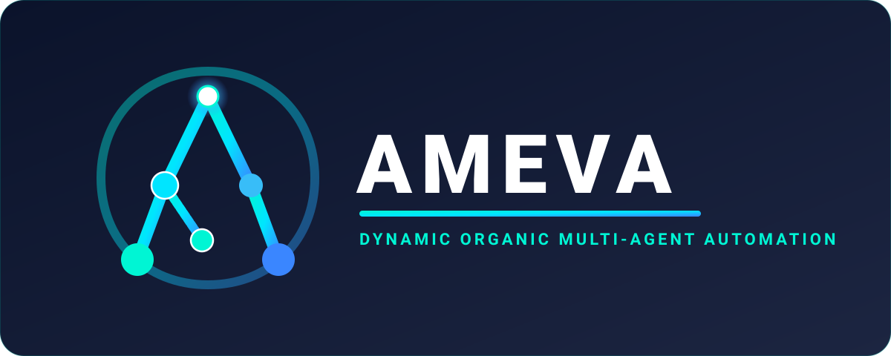

<p align="center">
  
</p>

<p align="center">
  <b>Autonomous Multi-Agent Enterprise Virtualized Automation</b><br/>
  <i>Orchestrating Intelligence Beyond the Cloud · Edge-Native AI Democratization · 100% Data Sovereignty</i>
</p>

<p align="center">
  <a href="https://uno-km.github.io/uno-km/"><b>🌐 Official Executive Portal & Digital CV</b></a> |
  <a href="FOUNDATION.md"><b>AMEVA Foundation</b></a> |
  <a href="https://uno-km.github.io/uno-km/dashboard/"><b>🔮 3D Neural Fabric Dashboard</b></a> |
  <a href="https://uno-km.github.io/ameva-forge/"><b>⚡ AMEVA-Forge Docs</b></a> |
  <a href="https://uno-kim.tistory.com/"><b>📖 Tech Blog</b></a>
</p>

<div align="center">
  <a href="https://uno-km.github.io/uno-km/">
    
  </a>
  <a href="FOUNDATION.md">
    
  </a>
  <a href="https://uno-km.github.io/uno-km/dashboard/">
    
  </a>
  <a href="https://uno-kim.tistory.com/">
    
  </a>
  <a href="mailto:zhfldk014745@naver.com">
    
  </a>
</div>

---

# 🌌 What is AMEVA Universe?

> **"거대 클라우드 서버 비용 없이, 개인의 브라우저와 엣지 기기만으로 완전한 자율 추론과 자동화를 실현합니다."**

**AMEVA**는 척박한 환경에서도 형태를 유연하게 바꾸며 끝내 살아남는 단세포 생물 **아메바(Amoeba)**의 생존력에서 착안한 **차세대 엣지 네이티브 AI 생태계**입니다.

### 🧬 AMEVA Acronym & Architecture
- **A — Agentic**: 스스로 상황을 분석하고 계획을 수립하는 자율 추론 & 의사결정 지능.
- **M — Multi-Agent**: 복잡한 작업을 원자 단위로 분해하여 전문 에이전트에 위임하는 계층적 오케스트레이션.
- **E — Ecosystem**: Desktop, Web, Android(Termux), Edge 기기를 유기적으로 연결하는 통합 플랫폼.
- **V — Virtualized**: 100% 클라이언트 브라우저 Pyodide WASM 샌드박스로 호스트를 완벽히 격리하는 보안 런타임.
- **A — Automation**: 서버 비용 제로의 실시간 비주얼 파이프라인 및 자동화 워크플로우.

```text
※ 보안 원칙: AMEVA는 웜이나 악성코드가 절대 아니며, 100% 클라이언트 격리 WASM 샌드박스에서 구동되는 합법적인 오픈소스 시스템 프레임워크입니다.
```

---

# 👤 Executive Digital Business Card & Technical CV

<table align="center" width="100%">
  <tr>
    <td width="220px" align="center" valign="top">
      <br/>
      <h3 style="margin-top: 8px; margin-bottom: 2px;"><b>김은호 (Eunho Kim)</b></h3>
      <p style="font-size: 0.88em; color: #64748b; margin-top: 0;"><code>@uno-km</code> · 1994.11.10</p>
      <span style="background: #e0f2fe; color: #0369a1; padding: 4px 8px; border-radius: 4px; font-weight: bold; font-size: 0.78em;">Tech Lead &amp; Systems Architect</span><br/>
      <a href="FOUNDATION.md"><span style="display:inline-block; margin-top:4px; background: #fef3c7; color: #92400e; padding: 3px 6px; border-radius: 4px; font-weight: bold; font-size: 0.74em; border: 1px solid #fde68a;">Founder &amp; Chair @ AMEVA Foundation</span></a>
    </td>
    <td valign="top">
      <table width="100%">
        <thead>
          <tr>
            <th colspan="2" align="left">📞 Contact &amp; Verification</th>
          </tr>
        </thead>
        <tbody>
          <tr>
            <td width="32%">📱 <b>전화번호</b></td>
            <td><a href="tel:010-4943-7334">010-4943-7334</a></td>
          </tr>
          <tr>
            <td>✉️ <b>이메일</b></td>
            <td><a href="mailto:zhfldk014745@naver.com">zhfldk014745@naver.com</a></td>
          </tr>
          <tr>
            <td>📖 <b>기술 블로그</b></td>
            <td><a href="https://uno-kim.tistory.com/" target="_blank">https://uno-kim.tistory.com/</a></td>
          </tr>
          <tr>
            <td>🐙 <b>GitHub</b></td>
            <td><a href="https://github.com/uno-km" target="_blank">https://github.com/uno-km</a></td>
          </tr>
          <tr>
            <td>📍 <b>위치</b></td>
            <td>대한민국 경기도 성남시 분당구</td>
          </tr>
        </tbody>
      </table>
      <table width="100%" style="margin-top: 8px;">
        <thead>
          <tr>
            <th colspan="2" align="left">🎓 Education &amp; Language</th>
          </tr>
        </thead>
        <tbody>
          <tr>
            <td width="32%">🎓 <b>대학원</b></td>
            <td>아주대학교 정보통신대학원 인공지능학과 석사 재학 (2026.08 ~)</td>
          </tr>
          <tr>
            <td>🎓 <b>학사</b></td>
            <td>한양사이버대학교 응용소프트웨어공학과 학사 졸업 (3.94 / 4.5)</td>
          </tr>
          <tr>
            <td>🗣️ <b>어학</b></td>
            <td>영어 (OPIc IH): 기술 소통 및 비즈니스 회화 가능</td>
          </tr>
        </tbody>
      </table>
    </td>
  </tr>
</table>

### 💬 Self-Introduction (자기소개)
> **"개발을 진심으로 즐기며, 어떤 난제든 끝까지 파고들어 해결해 내는 끈기와 소통력을 가진 엔지니어입니다."**
>
> 새로운 기술을 탐구하고 복잡한 문제를 분석하여 최적의 해답을 찾아내는 과정에서 큰 즐거움을 느낍니다. 
> 팀원 및 유관부서와 적극적으로 소통하고 협업하는 문화를 좋아하며, 맡은 일은 포기하지 않고 끝까지 완수하는 강한 책임감을 가지고 있습니다. 
> 2021년 10월부터 대기업 협력사(KT DS) 및 SK AX 자회사에서 사내 핵심 시스템 풀스택 개발, 대규모 DB 쿼리 튜닝(3초 → 0.3초), CI/CD 자동화 구축을 주도적으로 이끌어 왔습니다.

---

### 💼 Enterprise Career & Project Track Records (실무 경력 및 프로젝트 성과)

#### 🏢 1. SK AX 자회사 (2026.02 ~ 현재 / 재직중)
- **직무**: Tech Lead (TL), Business Analyst (BA), 사내 시스템 CI/CD 배포 파이프라인 구축, 백엔드/프론트엔드 풀스택 개발
- **핵심 성과**:
  - 사내 핵심 시스템 전사 CI/CD 배포 자동화 파이프라인 구축 및 백엔드(Java/Spring Boot) / 프론트엔드 풀스택 개발 총괄.
  - 비즈니스 요구사항 분석(BA) 및 테크 리드(TL) 역할을 주도적으로 수행하며 사내 시스템 안정성과 개발 생산성 극대화.

#### 🏢 2. KT DS 협력사 고객개발팀 (2021.10 ~ 2026.01 / 4년 4개월)
- **직무**: Tech Lead (TL), PM/PL, 사내 핵심 시스템(B2B/PLM) 구축 및 ITO 운영 개발
- **핵심 성과**:
  - **KT 엔터프라이즈 B2B/PLM 시스템 풀스택 개발 및 고도화**: 레거시 KOS 시스템의 웹/MSA 전환, 대규모 데이터 무중단(Zero-downtime) 이관 및 쿼리 튜닝(**3초 → 0.3초**, 10배 향상), 비즈니스 룰 엔진 최적화로 **상품 출시 리드타임 2주 → 3일 단축**.
  - **ITO 운영 안정화 및 DevOps 자동화 (Tech Lead/PM)**: 수수료 정산 배치 속도 개선(**0.5초 → 0.05초**), Jenkins CI/CD 배포 시간 단축(**30분 → 5분**), 보안성 검토 자동화(누락 0건) 및 **장애 대응 체계 개선(1시간 → 10분)**.

---

### 🛠️ Core Technical Competencies (핵심 기술 역량)

| 분야 | 핵심 보유 기술 및 툴셋 |
|:---|:---|
| **🧠 AI, Data Science & Reasoning** | `WebGPU Compute`, `Autograd Engine`, `MLOps`, `BitNet (1.58-bit LLM)`, `Deep Reasoning (CoT/ToT)`, `Prompt Engineering`, `Pyodide WASM`, `RAG Architecture`, `LoRA / QLoRA` |
| **☕ Backend & Architecture** | `Java 17/21`, `Spring Boot 3`, `Spring MVC`, `Spring Scheduler`, `JPA / Hibernate`, `MyBatis`, `Python`, `Maven / Gradle`, `RESTful API` |
| **💾 Database & Optimization** | `PostgreSQL`, `Oracle DB`, `MariaDB`, `MySQL`, `SQLite`, **대규모 쿼리 튜닝 (3s → 0.3s)**, `인덱스 최적화` |
| **🖥️ Frontend** | `JavaScript`, `React JS`, `TypeScript`, `SheetJS`, `Chart.js`, `Toast UI`, `jQuery / Ajax`, `HTML5 / CSS3` |
| **🚀 DevOps, Systems & Collab** | `Jenkins`, `GitHub Actions`, `Docker`, `Kubernetes (K8S)`, `Tomcat`, `Nginx`, `Jira / Confluence`, `Git / SVN`, `SOP / WBS` |

---

# 🌟 Flagship Core Open-Source Libraries (대표 오픈소스 라이브러리)

> **PyPI 및 npm에 공식 배포된 독립형 엣지 딥러닝·자동화 오픈소스 라이브러리 패키지입니다.**

| 라이브러리 | 핵심 기술 및 런타임 | 주요 기능 및 특징 | 패키지 & 문서 바로가기 |
|:---|:---:|:---|:---:|
| **⚡ [AMEVA-Forge](https://github.com/uno-km/ameva-forge)**<br/>[](https://pypi.org/project/ameva/) | **WebGPU**<br/>TypeScript / Python | **서버 비용 제로의 Browser-Native WebGPU Autograd Engine**<br/>PyTorch 완벽 호환 구문, WGSL 커스텀 셰이더 역전파, 제로 메모리 낭비 버퍼 풀 | [📖 공식 문서](https://uno-km.github.io/ameva-forge/)<br/>[⚡ 실시간 데모](https://uno-km.github.io/ameva-forge/demo.html)<br/>[📦 PyPI](https://pypi.org/project/ameva/) · [🐙 GitHub](https://github.com/uno-km/ameva-forge) |
| **📱 [Termux-Playwright](https://github.com/uno-km/termux-playwright-demo)**<br/>[](https://pypi.org/project/termux-playwright/) [](https://www.npmjs.com/package/termux-playwright) | **Android Bionic**<br/>Python / Node.js | **안드로이드 Termux 환경 비루트(Non-root) 브라우저 자동화**<br/>ARM64 Chromium CDP 직접 제어, 헤드리스 웹 스크래핑 & 테스팅 파이프라인 | [📖 공식 문서](https://uno-km.github.io/termux-playwright-demo/)<br/>[📦 PyPI](https://pypi.org/project/termux-playwright/) · [📦 npm](https://www.npmjs.com/package/termux-playwright)<br/>[🐙 GitHub](https://github.com/uno-km/termux-playwright-demo) |
| **🎨 [Termux-Diffusion](https://github.com/uno-km/termux-diffusion)**<br/>[](https://pypi.org/project/termux-diffusion/) [](https://www.npmjs.com/package/termux-diffusion) | **On-Device AI**<br/>Python / Node.js | **안드로이드 ARM64 네이티브 온디바이스 Stable Diffusion 런타임**<br/>모바일 엣지 기기에서 클라우드 연결 없이 로컬 이미지 생성 및 가속 | [📖 공식 문서](https://uno-km.github.io/termux-diffusion/)<br/>[📦 PyPI](https://pypi.org/project/termux-diffusion/) · [📦 npm](https://www.npmjs.com/package/termux-diffusion)<br/>[🐙 GitHub](https://github.com/uno-km/termux-diffusion) |
| **🎙️ [Termux-STT](https://github.com/uno-km/termux-stt)**<br/>[](https://pypi.org/project/termux-stt/) [](https://www.npmjs.com/package/termux-stt) | **On-Device STT**<br/>Python / Node.js | **안드로이드 온디바이스 통합 음성인식(STT) & 화자 분리**<br/>Whisper.cpp, Vosk, Sherpa-ONNX 3줄 통합, 순수 Python K-Means 화자 분리 | [📖 공식 문서](https://uno-km.github.io/termux-stt/)<br/>[📦 PyPI](https://pypi.org/project/termux-stt/) · [📦 npm](https://www.npmjs.com/package/termux-stt)<br/>[🐙 GitHub](https://github.com/uno-km/termux-stt) |
| **🚂 [Termux-Train](https://github.com/uno-km/termux-train)**<br/>[](https://pypi.org/project/termux-train/) | **Autograd & DL**<br/>Python (ARM64 Bionic) | **안드로이드 및 엣지 임베디드 전용 경량 텐서 & 온디바이스 LoRA 훈련 엔진**<br/>SafeTensors zero-copy, RoPE 트랜스포머, DAG autograd 역전파, 100/100 오딧 통과 | [📖 공식 문서](https://uno-km.github.io/termux-train/)<br/>[📦 PyPI](https://pypi.org/project/termux-train/) · [🐙 GitHub](https://github.com/uno-km/termux-train) |

---

# 🏛️ AMEVA Multi-Layer Ecosystem & Systems Architecture

> **데스크톱, 브라우저 샌드박스, 멀티에이전트 오케스트레이션, 인프라를 유기적으로 연결하는 AMEVA 4대 시스템 레이어입니다.**

### 🖥️ Layer 1. Enterprise Desktop & Smart Workbench (데스크톱 및 워크벤치 도구)
- **🏢 [AMEVA Workstation](https://github.com/uno-km/AMEVA-Workstation)**: 로컬 고성능 AI 모델 연동 및 엔터프라이즈급 통합 개발·작업대 환경.
- **💻 [AMEVA-Multi-CLI](https://github.com/uno-km/AMEVA-Multi-CLI)**: 트리 기반 무한 분할 레이아웃, 80 FPS 저지연 스마트 PTY 배치 및 DevSecOps 가드레일 내장 터미널 워크벤치.
- **🪟 [AMEVA Window Assistant](https://github.com/uno-km/AMEVA-Window-Assistant)**: OCR-First 화면 인식 & 로컬 llama.cpp 추론 기반의 프라이버시 보호형 Windows 데스크톱 AI 어시스턴트.
- **🌐 [AMEVA Edge Browser](https://github.com/uno-km/AMEVA-Edge-Browser)**: 100% 로컬 보안 격리 및 엣지 AI 웹 에이전트 구동에 최적화된 전용 브라우저 런타임.

### ⚙️ Layer 2. Model Context Protocol (MCP) & WASM Sandbox (MCP 및 보안 격리)
- **⚙️ [MCP-Wasm-Toolkit](https://github.com/uno-km/MCP-Wasm-Toolkit)**: 웹 크롤러, 동적 코드 실행 등 위험도가 높은 연산을 100% 격리된 브라우저 Pyodide WASM 샌드박스로 안전하게 격리 구동 ([🚀 OS 실행](https://uno-km.github.io/MCP-Wasm-Toolkit/frontend/ameva_os.html) | [✨ 체험관](https://uno-km.github.io/MCP-Wasm-Toolkit/promo/)).
- **🧰 [MCP Dynamic Utils Hub](https://github.com/uno-km/MCP-Wasm-Toolkit)**: GitHub 원격 도구 코드를 SSE(ntfy) 채널을 통해 서버 재부팅 없이 AI 에이전트 활성 세션에 3초 내 동적 핫리로드.
- **🚀 [AMEVA OS Playground](https://uno-km.github.io/MCP-Wasm-Toolkit/frontend/ameva_os.html)**: 로컬 호스트 자원과 브라우저 격리 샌드박스를 결합한 가속 하이브리드 가상 운영체제 개발 환경.

### 🤖 Layer 3. Autonomous Agents, Simulation & Perception (자율 에이전트, 사회 시뮬레이션 & 음성)
- **🎭 [Dead Internet Theatre](https://github.com/uno-km/AMEVA-Dead-Internet-Threatre)**: Docker 기반 100% 자율 멀티에이전트 가상 사회 시뮬레이터 (에이전트 간 자율 상호작용 및 집단 담론 형성).
- **🎼 [AMEVA Agent Orchestra](https://github.com/uno-km/AMEVA-Agent-Orchestra)**: Nobles(전략 의사결정)와 Workers(실행) 계층 분해 기반 다중 에이전트 오케스트레이션 엔진 (Semantic Drift 방지).
- **🎙️ [AMEVA STT Trainer & Agent](https://github.com/uno-km/AMEVA-STT-Trainer)**: Whisper 기반 한국어 음성 데이터 수집부터 LoRA 파인튜닝, 실시간 엣지 음성 인식 에이전트 파이프라인.

### 🧠 Layer 4. SRE Infrastructure & Resilient Data Pipeline (인프라 & 데이터)
- **⚡ [AMEVA Model Nexus](https://github.com/uno-km/AMEVA-Model-Nexus)**: SRE 원칙 기반 다이내믹 스코프드 스로틀링(기기 온도/전력 실시간 감지) 및 우선순위 스케줄링 AI 게이트웨이.
- **📄 [AMEVA Doc AI](https://github.com/uno-km/AMEVA-Doc-AI)**: 데이터 유출이 원천 차단된 100% 오프라인 로컬 문서 인텔리전스 및 지식 기반 RAG 파이프라인.
- **📦 [AMEVA Data Harvester](https://github.com/uno-km/AMEVA-Data-Harvester)**: SCP, HTTPS, Telegram Bot 등 다중 전송 경로 기반의 무손실(Zero-loss) 엣지 데이터 전달기.
- **💾 [AMEVA Database](https://github.com/uno-km/AMEVA-Database)**: 분산 AMEVA 에코시스템 로그 분석 및 임베디드 SQLite 데이터 인스펙터.
- **🕹️ [AMEVA Conductor](https://github.com/uno-km/AMEVA-Conductor)**: 원격 크로스플랫폼 환경에서 인간과 AI 에이전트 간의 상호작용을 제어하는 리모트 UI.

---

> 📚 **AMEVA 생태계 원본 상세 문서 및 브랜드 가이드:**
> - [🏛️ **AMEVA Ecosystem: Full Architecture & Research Documentation (생태계 원본 상세 리드미)**](docs/README_ECOSYSTEM.md) — 12개 프로젝트별 심층 분석, SRE 스로틀링, 실시간 벤치마크, 3단계 청사진, 전문 용어 사전 전체 수록
> - [🎨 **Official Brand & Design System Guide**](assets/brand/BRAND_GUIDE.md) — 공식 브랜드 아이덴티티 및 디자인 가이드

---

## 🚀 AMEVA Setup Universe (One-Click Installer)

```powershell
# Windows PowerShell 1-Click Bootstrap
irm https://raw.githubusercontent.com/uno-km/uno-km/main/setup-universe/setup.ps1 | iex
```

```bash
# Linux / macOS / Android Termux 1-Click Bootstrap
curl -fsSL https://raw.githubusercontent.com/uno-km/uno-km/main/setup-universe/setup.sh | bash
```

---

### 🌐 Open-Source Contributions & Community PRs
- [BitNet (microsoft/BitNet)](https://github.com/uno-km/BitNet): 1-bit LLM ARM NEON / I2_S 커널 및 환경 빌드 관련 풀 리퀘스트(PR) 및 코드 기여 참여

---

<p align="center">
  &copy; 2026 <b>Eunho Kim (김은호 / @uno-km)</b> · Senior Full-Stack Engineer & Systems Architect.<br/>
  High-Clarity Enterprise Open-Source Technical Portfolio · Powered by AMEVA Ecosystem.
</p>
