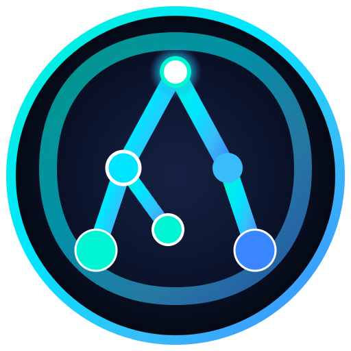

# 🧬 AMEVA Ecosystem Official Brand Identity & Design System

> **Brand Vision**: **Clean Aqua-Cyan Universe & Dynamic Asymmetric Organic Automation**
> Official Brand Guide for AMEVA (Autonomous Multi-Agent Enterprise Virtualized Automation) Ecosystem.

---

## 🖼️ Brand Assets

| Asset Type | File Path | Preview |
| :--- | :--- | :--- |
| **Brand Logo (SVG)** | [`assets/brand/ameva_logo.svg`](./ameva_logo.svg) |  |
| **Unified Favicon (SVG)** | [`assets/brand/favicon.svg`](./favicon.svg) |  |

---

## 🔍 Origin & Acronym Definition

### 🧬 Biological Origin (Amoeba)
- Represents an organic entity that dynamically adapts its shape to its environment, multiplying autonomously and expanding seamlessly across edge infrastructure.

### 🤖 Acronym Architecture
- **A**gentic — Self-reasoning and autonomous decision-making AI agents.
- **M**ulti-agent & **M**ultimedia — Hierarchical agent orchestration & rich media authoring.
- **E**cosystem — Integrated enterprise platform bridging Desktop, Cloud, and Edge.
- **V**irtualized — Isolated offline WASM/Electron sandboxes & inference runtimes.
- **A**utomation — Self-executing pipelines with real-time visual output.

---

## 🌿 Graphic Design Rationale (Favicon & Symbol)

```text
       [1] Root Node (Agentic AI Core)
       /  \
   [1-1]  [1-2] (1st Level Division)
   /   \     \
[1-1-1] [1-1-2] [1-2-1] (Inward Extending Dynamic Organic Pseudopod Node)
```

1. **'A' Monogram Backbone**: The primary structural nodes form a bold, unmistakable capital letter **'A'**.
2. **Inward Organic Pseudopod (`[1-1-2]`)**: Instead of a rigid, symmetrical frame, an extra node branches inward towards the center-right at a 60-degree angle with a longer stem. This breaks cold mechanical symmetry and imbues the logo with living, dynamic biological energy.
3. **Outer Universe Ring**: Symbolizes an uninterrupted, self-sustaining loop of edge-AI automation.

---

## 🎨 Color Palette & CSS Tokens

- **No Purple, No Harsh Primary Red**
- **Primary Accent**: High-Luminance Aqua Cyan (`#00F5D4`) & Ocean Sky Blue (`#3A86FF`)
- **Background**: Deep Cosmic Midnight (`#0B132B` / `#1C2541`)

```css
:root {
  --ameva-bg-base: #0b132b;
  --ameva-bg-surface: #1c2541;
  --ameva-grad-primary: linear-gradient(135deg, #00f5d4 0%, #00e5ff 50%, #3a86ff 100%);
  --ameva-accent-cyan: #00f5d4;
  --ameva-accent-aqua: #00e5ff;
  --ameva-accent-sky: #38bdf8;
  --ameva-accent-ocean: #3a86ff;
  --ameva-text-primary: #ffffff;
}
```
