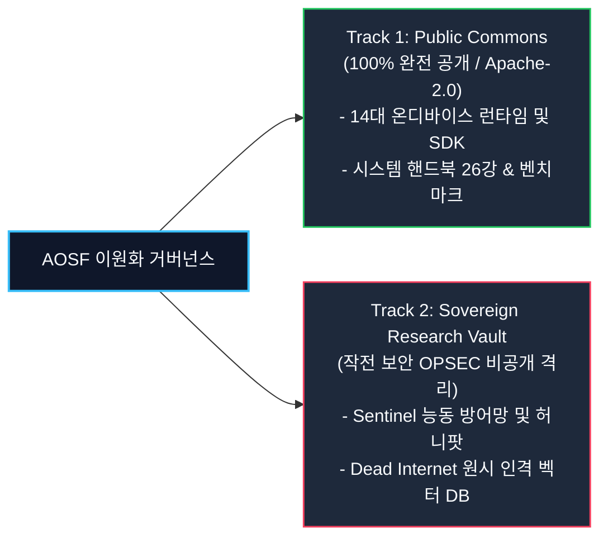

# AOSF Governance & Community Guidelines
AMEVA 프로젝트 운영 원칙 및 커뮤니티 가이드

---

## 1. 운영 및 의사결정 원칙 (Direct & Honest Governance)

AMEVA 오픈소스 프로젝트는 복잡한 투표 정족수, 거창한 위원회 선거 같은 형식적인 관료주의를 철저히 배제합니다.

1. **메인테이너 책임제 (Core Maintainership)**:
   - 본 프로젝트는 설립자이자 메인테이너인 **@uno-km (김은호)**이 소스코드 리뷰, 릴리즈 태깅, 기술적 방향성을 직접 책임지고 관리합니다.
2. **실기기 성능이 법이다 (Silicon Truth Over Politics)**:
   - 말이나 정치가 아닌, 실제 안드로이드 단말기와 에지 디바이스에서 측정된 성능 지표, 지연 시간, 메모리 안정성이 모든 기술적 결정의 기준입니다.

---

## 2. 주권형 이원화 오픈소스 거버넌스 규정 (Dual-Track Sovereign Governance Policy)

AMEVA Open-Source Foundation (AOSF)은 전 세계 개발자의 온디바이스 자립을 지원하는 **공공 오픈소스 생태계(Public Commons)**와 악의적 데이터 수탈 및 시스템 침해를 차단하는 **주권형 연구 볼트(Sovereign Vault)**의 이원화 거버넌스를 엄격히 준수합니다.

1. **Track 1: Public Commons (공공 오픈소스 계층 - Apache 2.0)**:
   - `AMEVA-Runtime`, `termux-stt`, `termux-diffusion`, `termux-bitnet`, `termux-vision`, `termux-playwright`, `AMEVA-Forge` 등 온디바이스 AI 런타임 및 개발자 도구 일체는 100% 오픈소스로 투명하게 개방합니다.
2. **Track 2: Sovereign Research Vault (주권 연구 및 능동 방어 격리 계층)**:
   - 무단 크롤러 및 적대적 AI 스크래퍼를 차단하는 **Sentinel 능동 방어망, 카나리 허니팟 트랩(Canary Trap), Dead Internet 사회실험 원시 텔레메트리 DB 및 인격 동역학 조작 가중치**는 작전 보안(OPSEC) 원칙에 따라 외부에 공개하지 않고 프라이빗 볼트에 격리합니다.
   - 방어 트랩 시그니처와 허니팟 코드를 공개하는 것은 공격자에게 우회 경로를 제공하는 자폭 행위이므로, 이는 OpenSSF 및 CNCF 보안 표준에 따른 정당하고 합법적인 비공개 보안 조치입니다.

---

## 3. 기여 및 피드백 가이드 (How to Contribute)

우리는 스스로를 완벽하다고 포장하지 않습니다.  
우리는 언제나 커뮤니티의 솔직한 피드백과 쓴소리를 진심으로 환영합니다.

1. **버그 리포트 & 이슈 제기**:
   - 단말기에서 크래시가 나거나 비효율적인 부분이 보인다면 언제든 GitHub Issues를 열어 거침없이 지적해 주십시오. 달게 받고 즉시 패치하겠습니다.
2. **Pull Requests (PR)**:
   - 더 가벼운 NEON 어셈블리 커널, 셰이더 최적화, 오탈자 수정 등 모든 기여를 환영합니다. 함께 토론하고 코드 머지를 진행합니다.
3. **GitHub Star(⭐️)로 응원하기**:
   - 이 프로젝트가 유용하셨다면 깃허브 스타를 눌러 힘을 보태주십시오. 1인 인디 개발자에게 가장 큰 원동력이 됩니다.

---

## 3. 연락처 및 협업 (Contact)

- **GitHub**: [github.com/uno-km](https://github.com/uno-km)
- **Email**: [zhfldk014745@naver.com](mailto:zhfldk014745@naver.com)
- **Tech Blog**: [uno-kim.tistory.com](https://uno-kim.tistory.com/)

---

**AMEVA Open-Source Foundation (AOSF)**  
*Simple. Honest. Powerful On-Device AI.*
